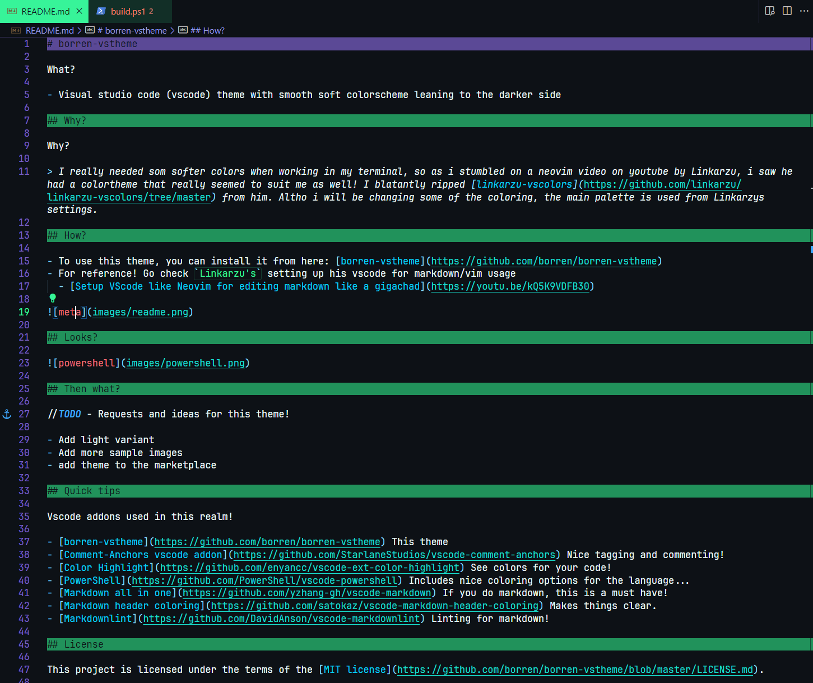
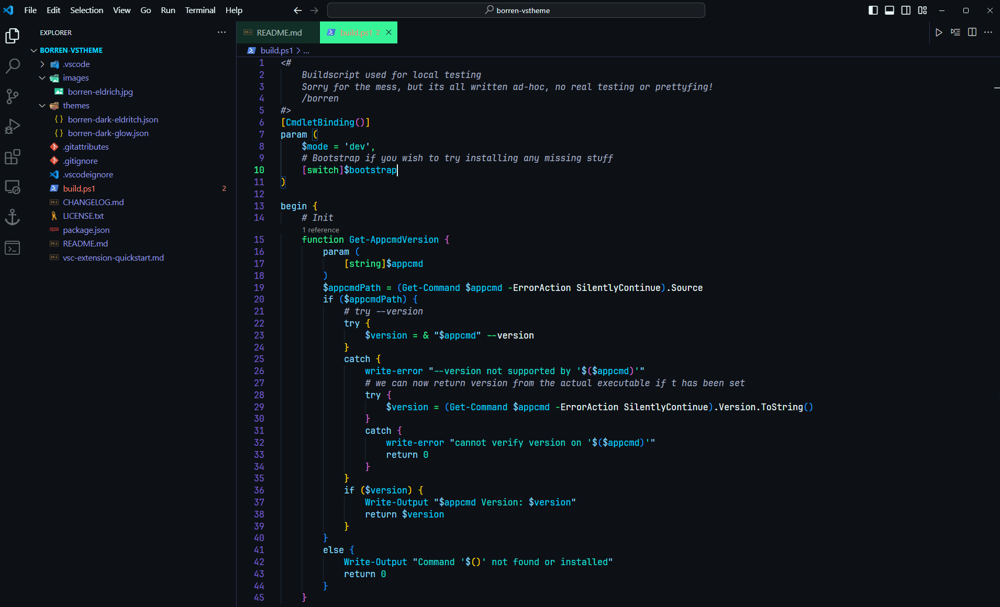

# borren-vstheme

**What?**

- Visual studio code (vscode) theme with smooth soft colorscheme leaning to the darker side

## Why?

I really needed som softer colors when working in my terminal, so as i stumbled on a neovim video on youtube by Linkarzu, i saw he had a colortheme that really seemed to suit me as well! I blatantly ripped [linkarzu-vscolors](https://github.com/linkarzu/linkarzu-vscolors/tree/master) from him. Altho i will be changing some of the coloring, the main palette is used from Linkarzys settings.

## How?

- To use this theme, you can install it from here: [borren-vstheme](https://github.com/borren/borren-vstheme)
- For reference! Go check `Linkarzu's` setting up his vscode for markdown/vim usage
  - [Setup VScode like Neovim for editing markdown like a gigachad](https://youtu.be/kQ5K9VDFB30)

## Looks?

## Then what?

//TODO - Requests and ideas for this theme!

- Add light variant
- Add more sample images
- add theme to the marketplace

## Quick tips

Vscode addons used in this realm!

- [borren-vstheme](https://github.com/borren/borren-vstheme) This theme
- [Comment-Anchors vscode addon](https://github.com/StarlaneStudios/vscode-comment-anchors) Nice tagging and commenting!
- [Color Highlight](https://github.com/enyancc/vscode-ext-color-highlight) See colors for your code!
- [PowerShell](https://github.com/PowerShell/vscode-powershell) Includes nice coloring options for the language...
- [Markdown all in one](https://github.com/yzhang-gh/vscode-markdown) If you do markdown, this is a must have!
- [Markdown header coloring](https://github.com/satokaz/vscode-markdown-header-coloring) Makes things clear.
- [Markdownlint](https://github.com/DavidAnson/vscode-markdownlint) Linting for markdown!

## License

This project is licensed under the terms of the [MIT license](https://github.com/borren/borren-vstheme/blob/master/LICENSE.md).
